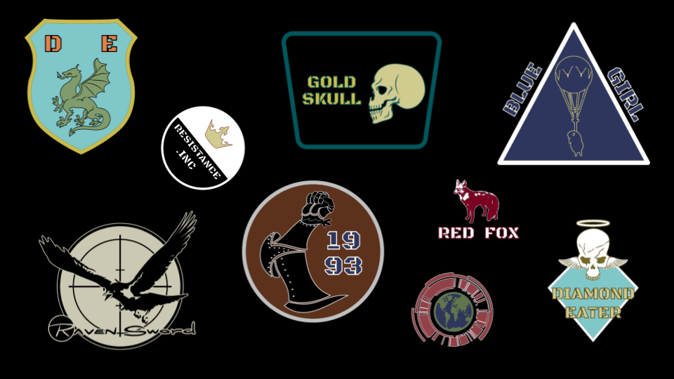
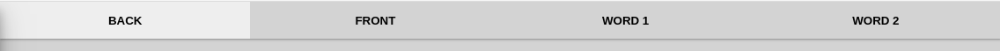

# Instructions

Each emblem consists of four parts, a back, a front, and two words. You can choose to use all of these parts, or leave some out.

When you put these parts together, you can create various emblems.

# Choosing your parts

You will notice that there are four tabs that you can click on. The selected tab determines which part you're currently editing.

Once you select a tab, you can then choose the actual image for that part.

You can then go through and select an image for each part.

# Coloring

You can also apply colors to each part. You can choose a primary color and a secondary color. In the screenshot below, the color palette on the left is for the primary color, and the color palette on the right is for the secondary color. Usually the primary color takes up most of the image, and the secondary color is the outline.

# Positioning

You can also move each part around. Depending on which tab you've selected, the arrow buttons will move the selected part around on your screen. They are located in the top left-hand corner of the preview.

*Hint:* if you're on a desktop or laptop, you can also click on the preview and move the part around with your arrow keys.

# Scaling & Rotating

Next, you'll notice in the bottom left-hand corner of the preview that there are also buttons for scaling a part up/down, and rotating it left/right.

*Hint:* if you're on a desktop or laptop, you can also use the control key + the arrow keys to scale and rotate the part.

# Undo & Redo

At some point you may want to undo/redo some changes as you've been working on your emblem. To do this you can simply use the undo and redo buttons in the top right-hand corner of the preview.

# Downloading

Finally, after you're satisfied with your emblem, you can download it as a desktop wallpaper or phone wallpaper.

# Removing parts

Finally, you can also remove parts from your emblem using the tags just under the main tabs.

